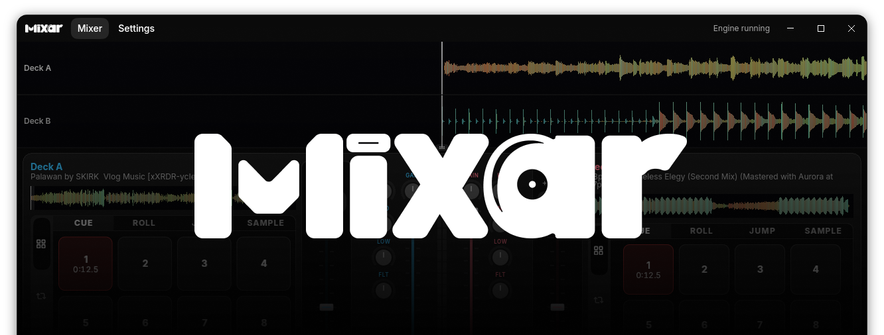

<p align="center">
  
</p>

# Mixar

[](https://github.com/geovannimp/mixar/actions/workflows/build.yml)
[](https://github.com/geovannimp/mixar)

Open-source DJ software: dual decks, a mixer, and a library on a Rust audio engine.

Linux is the primary development platform. The app is under active development and is not a released product yet.

## Features

- Dual decks with overview + scrolling waveforms, beat grid, play/pause, seek, and tempo
- Mixer: gain, 3-band EQ, filter, volume, crossfader, cue/PFL, and VU meters
- Hot cues, loops, performance pads, sampler, and beat sync
- Library with folder collections, track metadata, and offline analysis (BPM, key, loudness, artwork)
- MIDI controller mappings
- Runtime-selectable audio backends: CPAL (PipeWire on Linux when available), miniaudio, or `null` for tests

The desktop UI is **Flutter** (`apps/gui-flutter`), bridged to Rust via flutter_rust_bridge (`crates/host-flutter`).

## Quick start

**Prerequisites:** [mise](https://mise.jdx.dev) (recommended), Rust stable with rustfmt/clippy, Flutter (pinned in `mise.toml`), and a working sound device. On Linux, install ALSA/PipeWire headers (`pkg-config`, `libasound2-dev`, `libpipewire-0.3-dev`, `clang` on Debian/Ubuntu) plus Flutter Linux desktop deps (GTK, etc.). Key lock uses the pure-Rust [`timestretch`](https://crates.io/crates/timestretch) engine.

```bash
git clone https://github.com/geovannimp/mixar.git
cd mixar
mise install
npm install
npm run flutter:dev
```

Sample tracks live in `samples/`. Headless tests can use `backend = "null"` so they do not need an audio device.

## Development

`npm install` at the repo root installs [lefthook](https://lefthook.dev) and [moon](https://moonrepo.dev). Pre-commit runs format and lint on staged Rust (`.rs`) and Dart (`.dart`) files.

```bash
npm run lint            # moon run :lint
npm run format:check    # moon run :format-check
npm run test            # moon run :test (includes Flutter analyze/test when affected)
npm run build           # moon run :build
npx moon ci --base main # mimic affected CI locally
```

Skip a hook job with `LEFTHOOK_EXCLUDE=lint,format`. Disable hooks with `LEFTHOOK=0`. Emergency only: `git commit --no-verify`.

CI (GitHub Actions) runs affected lint, format, build, tests (including Flutter analyze), and a cargo audit. A secondary Rust beta/nightly job runs when Rust paths change.

## Architecture

A producer thread runs DSP and writes interleaved stereo into a lock-free ring buffer. The backend audio callback only consumes that buffer — no allocations on the audio thread.

```text
Library / AudioSource
        │ load → PCM
        ▼
   Engine → decks + mixer (engine-dsp)
        │
        ▼
Producer thread ──► ring buffer ──► audio callback (CPAL / miniaudio / null)
```

Hosts talk to the engine and library over MessagePack buses (`engine-api`, `library-api`), not by calling `Engine` from the UI thread. Flutter uses FRB transports (`EngineTransport`, `LibraryTransport`, `ControllerTransport`).

```text
mixar/
├─ apps/gui-flutter/   # Flutter desktop UI
├─ crates/             # Cargo workspace (engine, backends, library, host-flutter, …)
└─ samples/            # Local demo audio
```

Default engine config is 48 kHz, 512-frame buffers. Backends are compiled in and chosen at runtime (`auto` / `cpal` / `miniaudio` / `null`).

To embed the engine without a GUI:

```rust
use engine_core::{AudioSource, Engine, EngineConfig, FileAudioSource};

let mut engine = Engine::new(EngineConfig::default())?;
engine.start()?;
engine.load_track(0, AudioSource::File(FileAudioSource::from_path("track.wav")))?;
engine.play(0)?;
```

## Documentation

- [Technical spec](docs/tech-spec.md) — crates, threading, config, backends
- [Deck spec](docs/deck-spec.md) — deck UI, mixer, pads, data model
- [Set history](docs/history-spec.md) — session logging, XSPF storage, export, OBS live output
- [Logging](docs/logging.md) — log files and verbosity
- [Waveforms](docs/dj-waveform-spec.md) and [analyzer](docs/audio-analyzer-spec.md)

For external tools (e.g. OBS text sources), watch the active session file under `{appSupport}/history/*.xspf` — see [history-spec §11](docs/history-spec.md#11--live-output-obs).

## Contributing

Open a pull request against `main`. Run `npm install` once so git hooks are installed, then keep `cargo fmt` / `cargo clippy` and Flutter analyze clean.

## License

[GPL-3.0](https://www.gnu.org/licenses/gpl-3.0.html)
